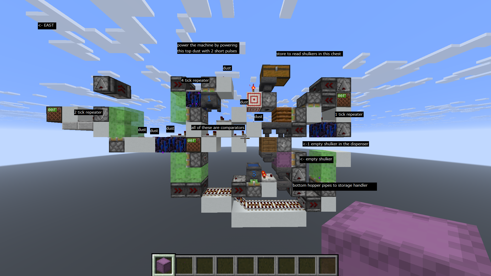

# Minecraft Music Machine

This is a script for converting nbs files to encoded music for a specific machine architecture.
The code is not that clean as I was not an experienced programmer when I made it.
I might occasionally spend time to improve the script, check out the TODO to see features I might add in the future.
The script right now is bare bones, I have posted a demo of the machine working after
using this script here https://www.tiktok.com/@reffij8/video/7557298192186920222

## How it works

The program will ask for a nbs file and output the shulker creation commands to output.txt.

## How to run
You must have python installed.
clone this repository and use the run.bat file or navigate to the code folder
and run 
```bash 
python main.py
```

## Architecture



- The image above shows a cell. 
- Some directions of the machine I have tested breaks the machine. I have not checked all directions but facing EAST as shown in the diagram will work.
- Cells are 1 wide tileable alternating slime and honey. 
- Each cell is in charge of a note on a given time offset. 
- Each cell takes a shulker and reads non-stackable items as notes and stackable items as rests. 
- Each cell can play at hopper speed, i.e. 8tps. 
- When multiple shulkers are to be read, the machine automatically switches to the next shulker once it is done with the prior.
- The switch takes an equivalent of 4 rests, so when making a song for this machine, ensure that shulker switches correspond to 4 rests in the actual song.
- Since the machine can only produce sound at 8tps, to produce songs where you want notes with intervals of 1tps 2tps or 4tps you must use multiple machines for the same note running simultaneously.
* 20tps song -> 8 machines per note
* 10tps song -> 4 machines per note
* 5tps song -> 2 machines per note
* 2.5tps song -> 1 machine per note

## Limitations
- Due to the architecture, notes in songs must never have a sequence of more than 27 notes or non 4 period rests.
- That is because a machine takes 4 rests to swap to the next shulker and a shulker can only store 27 slots. So, in order not to lose any notes the machine should swap during a 4 period rest, if a 4 period rest cannot be found it is determined to be incompatible with the machine.
- This restriction conflicts with a lot of songs. To fix you might have to manually edit the song, or create another redundant machine to handle the exception.
- This script will just raise a value error in such cases and its up to the user to manually edit the song
to make it compatible.

- If a song is in old nbs format this script won't be able to decode it. The fix is simple though. Simply
open the song in the newest version of note block studio and you should be prompted on updating the 
format to the new version.


## TODO
* allow for a coordinates config so that users can enter coordinates of the
machine generate fewer commands
* fix bug where last note is cut off
* change architecture to allow for fillers to play during
